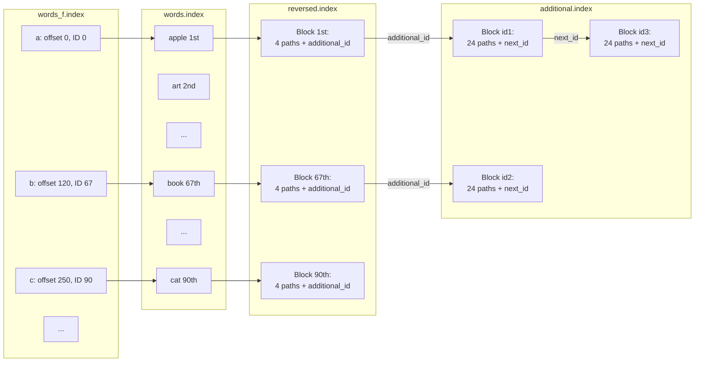
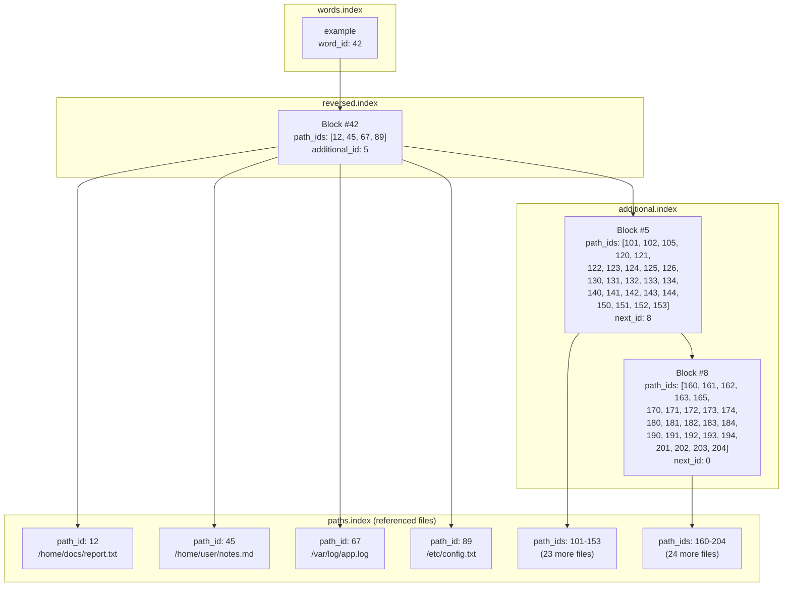

# File System Full-Text Search Index Structure

## Overview
The index uses multiple specialized files to optimize search performance while maintaining a small disk footprint. The default storage location is `.local/share/filesystem-full-text-search-indexer/`.

## Configuration
Most sizes can be increased or decreased to allow for larger indexes or to optimize for disk space. E.g the PathID byte amount, AdditionalID Byte amount, Words_f IDBlock can all be increased or decreased. This can only be set at compile time for now.

## Index Files

### 1. Path Index (`paths.index`)
- **Purpose**: Stores indexed file paths efficiently
- **Format**: 
  ```
  [2-byte length][path chars][2-byte length][path chars]...
  ```
- **Details**:
  - Each path entry starts with its length (2 bytes, uint16_t)
  - Followed by the actual path characters
  - Path IDs start at 1 (0 is reserved)
  - ID size configurable in future versions for larger indexes
  - Sequential path storage enables fast lookups

### 2. Path Word Count Index (`paths_count.index`)
- **Purpose**: Maintains word count per indexed file
- **Format**:
  ```
  [4-byte count][4-byte count]...
  ```
- **Details**:
  - Fixed 4 bytes per path
  - Direct indexing: `path_id × 4` gives byte offset
  - No separators needed due to fixed size

### 3. Words Index (`words.index`)
- **Purpose**: Stores all unique indexed words
- **Format**:
  ```
  [length byte(s)][word chars][length byte(s)][word chars]...
  ```
- **Details**:
  - Length byte encodes word length as normal number. It i by default 1 byte but can be increased to 2 or 4 in index_config (WORD_SEPERATOR_SIZE)
  - One byte per character(letter 'a' encoded as standard unsigned char(Extended ASCII))
  - Alphabetically sorted for binary search
  - Words are linked to reversed based on ID. The first word is linked to reversed ID0. The fifth to ID4.
  - WordsID or on Disk ID start from 0 and are only actually used on disk in words_f.

### 4. Word Fast Index (`words_f.index`)
- **Purpose**: Fast first-letter lookup table
- **Format**: 
  ```
  [8-byte value for 'a'][4-Byte value for ID '0' for 'a'][8-byte value for 'b'][4-Byte value for ID '35' for 'b']...[8-byte value for 'z'][4-Byte value for ID '3434' for 'z']
  ```
- **Details**:
  - 26 entries (a-z)
  - Each entry is an 8-byte uint64_t and a 4 byte uint32_t(This can be changed by editing index_config.h WORDS_F_LOCATION_SIZE to either 2,4 or 8 bytes(uint16t,uint32t,uint64t) ). total 12(or more) bytes per letter.
  - Points to first occurrence in words.index as a byte location.(e.g the words with letter 'b' begin t byte 300.) and it's ID. ID is needed to then access its reversed or additional.
  - Enables quick letter-based searches
  - If one entry doesn't have a word connected yet we set its location to the value of the next entry that has one or the end of the file location.
  - In the future will be able to also separate the second char of a char. e.g aa, ab, ac ... da, db..

### 5. Reversed Index (`reversed.index`)
- **Purpose**: Maps words to containing documents
- **Format**: Fixed 12-byte blocks 
  ```
  Block structure:
  [2-byte path_id][2-byte path_id][2-byte path_id][2-byte path_id][4-byte additional_id]
  ```
- **Details**:
  - Each block stores up to 4 path IDs (or more, this can be set in index_config.h(REVERSED_PATH_LINKS_AMOUNT))
  - Additional_id links to overflow storage
  - Exists for each word. Position is always relative to word id.
  - Block position = `(word_id × 12) - 12`
  - Path ID size can be increased to 4 or even 8 bytes length. This can be set in index_config.h when compiling. (PATH_ID_LINK_SIZE)
  - Additional ID size can also be increased/decreased to 2/4/8 bytes. This can be set in index_config.h when compiling. (ADDITIONAL_ID_LINK_SIZE)

### 6. Additional Index (`additional.index`)
- **Purpose**: Overflow storage for popular words
- **Format**: Fixed 52-byte blocks. Additional ID starts from 1. 1 is the block from byte 0-51.
  ```
  Block structure:
  [24 × 2-byte path_ids][4-byte next_block_id]
  ```
- **Details**:
  - Stores 24 path IDs per block (or more, can be configured in index_config ADDITIONAL_PATH_LINKS_AMOUNT at compile time )
  - Additional ID size can also be increased/decreased to 2/4/8 bytes. This can be set in index_config.h when compiling. (ADDITIONAL_ID_LINK_SIZE)
  - Chainable via next_block_id
  - Used when words appear in >4 documents
  




## Usage Examples

### Word in 3 Documents
```
Reversed block only:
Bytes 1-6:   Path IDs [1,2,3]
Bytes 7-8:   Path ID  [0] (unused)
Bytes 9-10:  Additional ID [0] (none needed)
```

### Word in 20 Documents
```
Reversed block:
Bytes 1-8:   Path IDs [1,2,3,4]
Bytes 9-10:  Additional ID [1]

Additional block #1:
Bytes 1-32:  Path IDs [5...20]
Bytes 33-48: Path IDs [0] (unused)
Bytes 49-50: Next block [0] (end of chain)
```

### Word in Many Documents
```
Reversed block:
Bytes 1-8:   First 4 path IDs
Bytes 9-10:  Points to additional block #1

Additional block #1:
Bytes 1-48:  Next 24 path IDs
Bytes 49-50: Points to additional block #2

Additional block #2:
Bytes 1-48:  Next 24 path IDs
Bytes 49-50: Points to next block or 0
```

## Configuration Notes
- planned Path ID size configurable to support larger indexes
- Block sizes and counts tuned for typical use cases (planned to customize this too.)
- File locations customizable in future version
