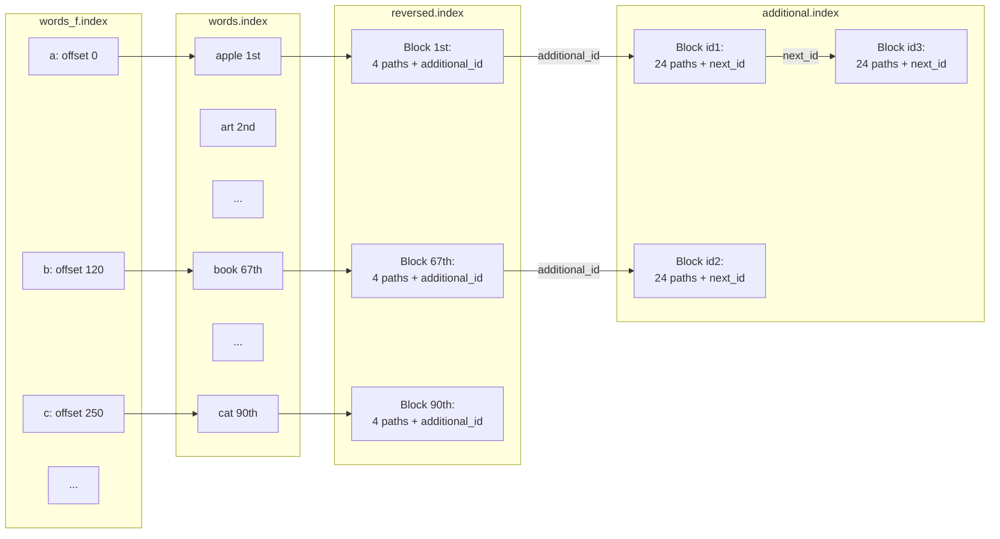

# File System Full-Text Search Index Structure

## Overview
The index uses multiple specialized files to optimize search performance while maintaining a small disk footprint. The default storage location is `.local/share/filesystem-full-text-search-indexer/`.

## Index Files

### 1. Path Index (`paths.index`)
- **Purpose**: Stores indexed file paths efficiently
- **Format**: 
  ```
  [2-byte length][path chars][2-byte length][path chars]...
  ```
- **Details**:
  - Each path entry starts with its length (2 bytes, uint16_t)
  - Followed by the actual path characters
  - Path IDs start at 1 (0 is reserved)
  - ID size configurable in future versions for larger indexes
  - Sequential path storage enables fast lookups

### 2. Path Word Count Index (`paths_count.index`)
- **Purpose**: Maintains word count per indexed file
- **Format**:
  ```
  [4-byte count][4-byte count]...
  ```
- **Details**:
  - Fixed 4 bytes per path
  - Direct indexing: `path_id × 4` gives byte offset
  - No separators needed due to fixed size

### 3. Words Index (`words.index`)
- **Purpose**: Stores all unique indexed words
- **Format**:
  ```
  [length byte][word chars][length byte][word chars]...
  ```
- **Details**:
  - Length byte encodes word length:
    - 0-30: Direct word length
    - >30: Used as separators 
    - 255: Words longer than 255 chars
  - One byte per character(letter 'a' starts at 0.)
  - Alphabetically sorted for binary search
  - Words are linked to reversed based on ID. The first word is linked to reversed ID1. The fifth to ID5.

### 4. Word Fast Index (`words_f.index`)
- **Purpose**: Fast first-letter lookup table
- **Format**: 
  ```
  [8-byte value for 'a'][8-byte value for 'b']...[8-byte value for 'z']
  ```
- **Details**:
  - 26 entries (a-z)
  - Each entry is an 8-byte uin64_t
  - Points to first occurrence in words.index as a byte location.(e.g the words with letter 'b' begin t byte 300.)
  - Enables quick letter-based searches
  - In the future will be able to also seperate the second char of a char. e.g aa, ab, ac ... da, db..

### 5. Reversed Index (`reversed.index`)
- **Purpose**: Maps words to containing documents
- **Format**: Fixed 10-byte blocks
  ```
  Block structure:
  [2-byte path_id][2-byte path_id][2-byte path_id][2-byte path_id][2-byte additional_id]
  ```
- **Details**:
  - Each block stores up to 4 path IDs
  - Additional_id links to overflow storage
  - Exists for each word. Position is always relative to word id.
  - Block position = `(word_id × 10) - 10`
  - Path ID size configurable in future versions(currently only 2 bytes = 65535 possible paths)

### 6. Additional Index (`additional.index`)
- **Purpose**: Overflow storage for popular words
- **Format**: Fixed 50-byte blocks. Additional ID starts from 1. 1 is the block form byte 1-50.
  ```
  Block structure:
  [24 × 2-byte path_ids][2-byte next_block_id]
  ```
- **Details**:
  - Stores 24 path IDs per block
  - Chainable via next_block_id
  - Used when words appear in >4 documents
  



## Usage Examples

### Word in 3 Documents
```
Reversed block only:
Bytes 1-6:   Path IDs [1,2,3]
Bytes 7-8:   Path ID  [0] (unused)
Bytes 9-10:  Additional ID [0] (none needed)
```

### Word in 20 Documents
```
Reversed block:
Bytes 1-8:   Path IDs [1,2,3,4]
Bytes 9-10:  Additional ID [1]

Additional block #1:
Bytes 1-32:  Path IDs [5...20]
Bytes 33-48: Path IDs [0] (unused)
Bytes 49-50: Next block [0] (end of chain)
```

### Word in Many Documents
```
Reversed block:
Bytes 1-8:   First 4 path IDs
Bytes 9-10:  Points to additional block #1

Additional block #1:
Bytes 1-48:  Next 24 path IDs
Bytes 49-50: Points to additional block #2

Additional block #2:
Bytes 1-48:  Next 24 path IDs
Bytes 49-50: Points to next block or 0
```

## Configuration Notes
- planned Path ID size configurable to support larger indexes
- Block sizes and counts tuned for typical use cases (planned to customize this too.)
- File locations customizable in future version
