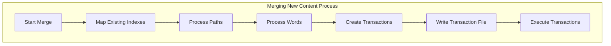
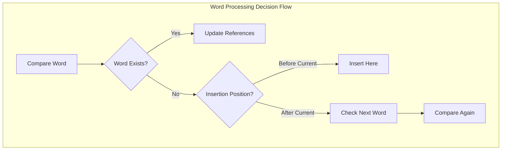
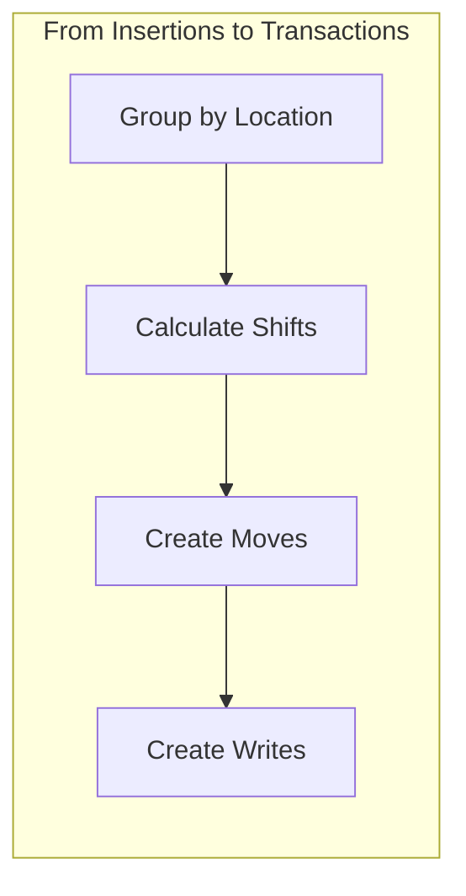
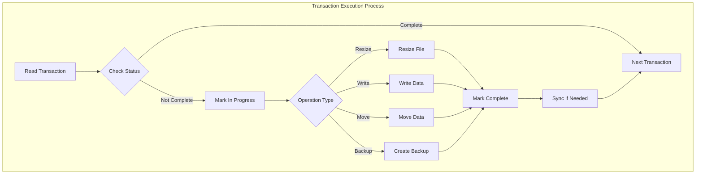

# Transaction and Merging System Documentation

## Overview
The Transaction System provides a structured approach to safely modify index files when adding new content. This document explains how the merging process works and how transactions protect data integrity during updates while enabling recovery after crashes. The Index can never become corrupted and is always fixable as long as the backup/transaction/index files were not modified externally.

## Transaction Structure

### Transaction Components
- **Purpose**: Track changes to index files and enable recovery
- **Format**: Each transaction has a header and optional content
  ```
  Header: 27 bytes
  [1-byte status][1-byte index_type][8-byte location][8-byte backup_id][1-byte operation_type][8-byte content_length]
  ```
- **Content**: Variable length data following the header (for Write and Move operations. Move Operations use a 8byte content always and content_length is used for something else)

### Transaction Types
- **Resize (2)**: Extends an index file to a new size
- **Write (1)**: Overwrites Content at a specific location
- **Move (0)**: Shifts existing data to make room for insertions
- **Backup (3)**: Creates a backup before potentially destructive operations

## Merging Process



### Path Mapping
- **Functions**: Maps between in-memory IDs and on-disk IDs
- **Process**:
  - Scan existing paths and compare with new ones
  - Create mapping between local and disk IDs
  - Prepare transactions for new paths
  - Update path counts where needed

### Word Processing
For each word in the new content:
1. **Find position**: Use `words_f.index` to jump to correct letter section
2. **Compare words**: Character-by-character comparison
3. **Take action**:
   - If word exists: Update path references
   - If word is new: Track for insertion at correct alphabetical position



### Tracking Insertions
- **Insertions**: Intermediate structure before creating transactions
- **Size tracking**: System maintains counters for total bytes needed:
  - `words_new_needed_size`: For all new words
  - `reversed_new_needed_size`: For new reversed blocks
  - `additional_new_needed_size`: For new additional blocks

## Transaction Creation

### Transaction Sequence
1. **Resize transactions**: Added first to ensure sufficient space
2. **Updating Existing data**: Adds references in existing reversed or additional blocks to new additionals. Fills up empty reversed or additional slots
3. **Data movement**: Transactions to shift existing data to make place for insertions
4. **Content writing**: Transactions to add new content

### Insertion to Transaction Conversion
The system:
1. Groups insertions by location
2. Calculates byte shifts at each location
3. Creates move operations in reverse order (to prevent overwriting)
4. Adds backup operations where It would overwrite itself. Backups because in case of failure we can't just repeat it. Only the part moving will be backed up.
5. Creates write operations at adjusted locations



### Words_F Table Updates
- Tracks how new words affect letter jump positions
- Maintains a counter for changes after each letter (a-z)
- Updates the entire jump table in a single transaction

## Transaction Execution

### Execution Flow


### Recovery Features
- **Status flags**: Each transaction is marked as:
  - `0`: Not started
  - `1`: In progress
  - `2`: Completed
- **Backups**: Created before potentially destructive operations
- **Progressive execution**: System can restart from last completed transaction
- **Syncing to disk**: The Transaction file and all index files are synced to disk after critical operations(resize, move, backup). For writing it is only synced after 5000 continues writes to speed up the execution.

### Performance Optimization
- **Batch syncing**: Write operations sync in batches (every 5000 operations)
- **Critical syncs**: Resize and backup operations always sync immediately
- **Memory-mapped access**: Uses memory-mapped files for performance

## Transaction File
- **Location**: `transaction/transaction.list`
- **Format**: Sequential transaction records
- **Backup Files**: Stored in `transaction/backups/[backup_id].backup`

## Example: Adding New Content

```
When adding a new word "dinosaur" between "diamond" and "dog":

1. Resize transactions (prepare space in files)
2. Move transaction (shift "dog" and later words)
3. Write "dinosaur" to words.index
4. Create reversed block for "dinosaur"
5. Update words_f.index jump table
```

## Recovery Process
If a system crash occurs:
1. On restart, system detects the transaction file
2. Processes each transaction based on status:
   - Status=2: Skip (already completed)
   - Status=1: Check for backup and restore if available. Then redo the Transaction.
   - Status=0: Execute normally
3. Continues until all transactions complete

## Design Considerations
1. **Durability**: Changes recorded before being applied
2. **Recoverability**: System can recover from interruptions
3. **Data integrity**: Backups protect against corruption
4. **Progressive execution**: Transactions processed in order
5. **Performance**: Batch syncing to disk on recoverable actions reduces disk operations
