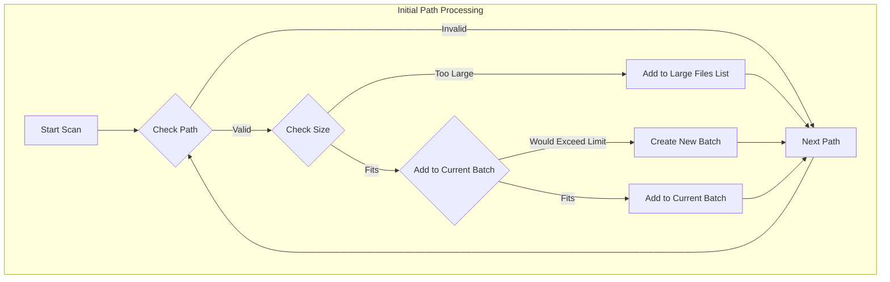
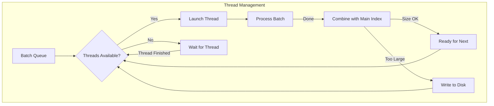
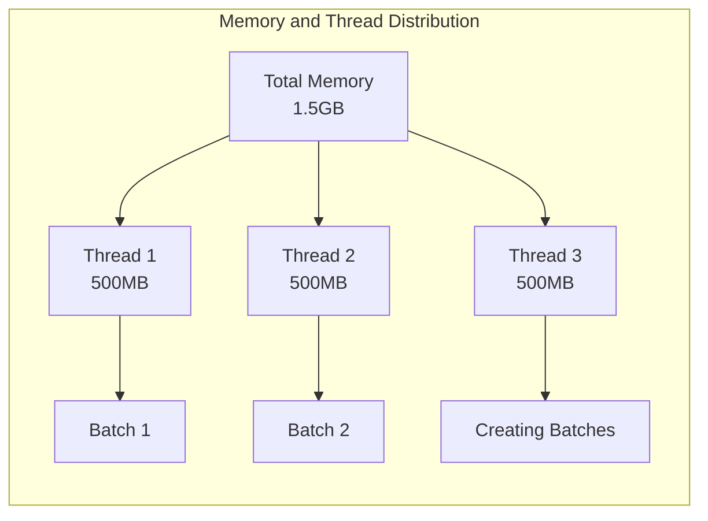

# Multi-Threading System Documentation

## Overview
The indexing system uses a configurable number of threads and memory limits to efficiently process files. This document explains how files are batched, processed, and combined while maintaining memory constraints.

## Configuration Parameters
- **Thread Count**: User-configurable number of threads
- **Memory Limit**: Maximum local memory usage (configurable)
- **Per-Thread Memory**: `memory_limit / thread_count`

## Process Flow

### 1. Batch Creation Phase


### 2. Thread Management System


## Detailed Process Description

### 1. Batch Creation
- System reserves one thread for batch creation when files remain to be processed
- Each batch's maximum size = `memory_limit / thread_count`
- Files are checked for:
  - Valid extensions
  - Path patterns (e.g., "/." exclusion)
  - Size limits

### 2. Thread Allocation


### 3. Combination Process
When a thread completes processing:
1. Attempts to combine with main index
2. If combined size > memory_limit:
   - Writes current main index to disk
   - Other threads must wait if finished
   - Processing threads continue their work
3. After write completes:
   - Waiting threads can combine
   - New threads can start

### 4. Large File Handling
- Files larger than `memory_limit / thread_count` are collected separately
- Will be processed in a future phase (not implemented yet)
- Logged for user information

## Memory Management Example
For a system with 1.5GB memory limit and 3 threads:
- Per-thread limit: 500MB
- Batch sizes must not exceed 500MB
- Example batch distribution:
  ```
  Batch 1: 450MB (3 files: 200MB, 150MB, 100MB)
  Batch 2: 480MB (2 files: 300MB, 180MB)
  Batch 3: 420MB (4 files: 150MB, 120MB, 100MB, 50MB)
  ```

## Important Notes
1. Thread count is automatically adjusted if higher than system capabilities
2. One thread reserved for batch creation until all paths are processed.
4. Local indexes are combined only when memory allows
5. System automatically handles disk writes when memory limits are reached
